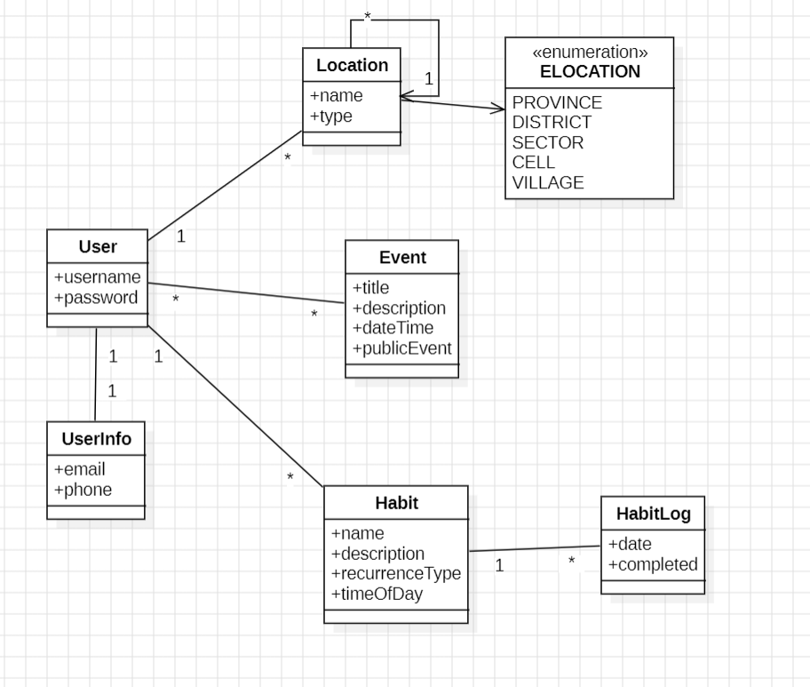

# Planning Sync

## Models
- User
- UserInfo
- Location
- Habit
- HabitLog
- Event

## Diagram


## Relationships
- OneToOne: 
    - User 1-1 UserInfo
- OneToMany:
    - User 1-* Habit
    - User *-1 Location
    - Habit 1-* HabitLog
- ManyToMany:
    - User \*-* Events

## Endpoints

### Users
#### Add : `/api/user/register`
```json
{
    "username":"user1",
    "password":"password1",
    "role":"member",
    "village": {
        "name":"village1"
    }
}
```
### UserInfo
#### Add : `/api/userinfo/{username}`
```json
{
    "email":"email1",
    "phone":"phone1"
}
```

### Location
#### Add : `/api/location/`
```json
{
    "name":"district1",
    "type":"DISTRICT",
    "parentLocation":{
        "name": "province1"
    }
}
```

### Habit
#### Add : `/api/habit/`
```json
{
  "name": "Week planning",
  "description": "30 minutes week planning",
  "recurrenceType": "WEEKLY",
  "timeOfDay": "06:00:00",
  "dayOfWeek": "MONDAY"
}
```

### HabitLog
#### Add : `/api/habit/log`
```json
{
    "date": "2025-10-29",
    "completed": true
}
```
### Event
#### Add : `/api/event/`
```json
{
  "title": "Community Clean-Up",
  "description": "Neighborhood clean-up event",
  "publicEvent": true,
  "dateTime": "2025-11-02T09:00:00"
}
```